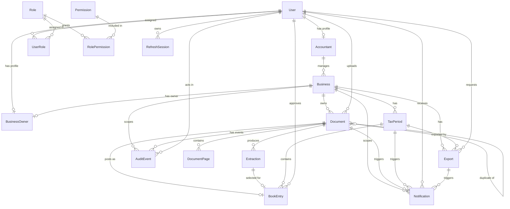

# Database Documentation

## 1. Overview

This PostgreSQL database supports the complete MVP lifecycle:

1. A user authenticates and receives permissions through roles.
2. An accountant manages one or more businesses.
3. Each business may have one business-owner profile.
4. Accountants and owners upload documents.
5. Documents are split into pages and processed into extractions.
6. Approved extractions become purchase or sales book entries.
7. Book entries are grouped into tax periods.
8. Exports, notifications, and immutable audit events record resulting activity.

The Prisma schema is the source of truth:

- Schema: `src/database/prisma/schema.prisma`
- Migrations: `src/database/prisma/migrations`
- Default roles and permissions: `src/database/prisma/seed.ts`

## 2. Design Conventions

- Primary identifiers are UUIDs.
- Prisma property names use `camelCase`; PostgreSQL columns use `snake_case`.
- `created_at` records creation time. `updated_at` is maintained by Prisma.
- Nullable fields are marked **Optional** below.
- Money uses `Decimal(18,2)`, never floating-point numbers.
- Flexible AI, tax-mapping, and audit data uses PostgreSQL `JSONB`.
- Authentication tokens are never stored directly. Only refresh-token hashes are stored.
- Foreign keys use restrictive deletion for accounting records and cascading deletion for dependent technical records.
- Business access isolation must also be enforced in service/repository queries. RBAC permissions alone do not determine which business a user may access.

## 3. Entity Relationship Overview

## 4. Cardinality Summary

| Parent | Relationship | Child | Rule |
|---|---|---|---|
| User | 1 to 0..1 | Accountant | A user may have one accountant profile. |
| User | 1 to 0..1 | BusinessOwner | A user may have one owner profile. |
| User | many to many | Role | Connected through `user_roles`. |
| Role | many to many | Permission | Connected through `role_permissions`. |
| User | 1 to many | RefreshSession | A user can have multiple active/device sessions. |
| Accountant | 1 to many | Business | Every business belongs to exactly one accountant. |
| Business | 1 to 0..1 | BusinessOwner | A business can have at most one owner login. |
| Business | 1 to many | Document | Every document belongs to one business. |
| Document | 1 to many | DocumentPage | A document can contain multiple pages. |
| Document | 1 to many | Extraction | Reprocessing and edit history create multiple extractions. |
| Document | 1 to 0..1 | BookEntry | A document can be posted only once. |
| Extraction | 1 to 0..1 | BookEntry | A book entry selects one extraction version. |
| TaxPeriod | 1 to many | BookEntry | Every entry belongs to one period. |
| Business | 1 to many | TaxPeriod | Periods are isolated per business. |
| Business | 1 to many | Export | Every export belongs to one business. |
| TaxPeriod | 1 to many | Export | An export may optionally target one period. |
| User | 1 to many | Notification | Every notification has one recipient. |
| User/Business/Document | 1 to many | AuditEvent | Events may reference their actor and domain scope. |

## 5. Authentication and Authorization Tables

### `users`

**Purpose:** Central authentication identity shared by accountants and business owners.

| Attribute | Type | Required | Constraints / Meaning |
|---|---|---:|---|
| `id` | UUID | Yes | Primary key. |
| `email` | Text | No | Unique when present. |
| `username` | Text | Yes | Unique login name. |
| `password_hash` | Text | Yes | Bcrypt password hash. |
| `must_change_password` | Boolean | Yes | Defaults to `false`; set for temporary owner credentials. |
| `is_active` | Boolean | Yes | Defaults to `true`; controls login access. |
| `locale` | `Locale` | Yes | Defaults to Albanian (`SQ`). |
| `last_login_at` | Timestamp | No | Most recent successful login. |
| `created_at` | Timestamp | Yes | Creation time. |
| `updated_at` | Timestamp | Yes | Last update time. |

**Important indexes:** unique `email`, unique `username`, index on `is_active`.

**Relationships:** Optional accountant profile, optional owner profile, many roles, refresh sessions, notifications, uploads, approvals, exports, and audit events.

### `accountants`

**Purpose:** Stores accountant-specific profile data while authentication remains in `users`.

| Attribute | Type | Required | Constraints / Meaning |
|---|---|---:|---|
| `user_id` | UUID | Yes | Primary key and FK to `users.id`. |
| `first_name` | Text | Yes | Accountant first name. |
| `last_name` | Text | Yes | Accountant last name. |

**Cardinality:** One user to zero-or-one accountant profile; one accountant to many businesses.

**Delete behavior:** The linked user cannot be deleted while the accountant profile exists.

### `business_owners`

**Purpose:** Connects a user login to the single business it is allowed to access.

| Attribute | Type | Required | Constraints / Meaning |
|---|---|---:|---|
| `user_id` | UUID | Yes | Primary key and FK to `users.id`. |
| `business_id` | UUID | Yes | Unique FK to `businesses.id`. |
| `credentials_shown_at` | Timestamp | No | Records when temporary credentials were shown once. |

**Cardinality:** One user to zero-or-one owner profile; one business to zero-or-one owner.

**Delete behavior:** Deleting a business deletes its owner profile. The user identity must be handled separately.

### `roles`

**Purpose:** Defines named authorization roles such as `ACCOUNTANT` and `BUSINESS_OWNER`.

| Attribute | Type | Required | Constraints / Meaning |
|---|---|---:|---|
| `id` | UUID | Yes | Primary key. |
| `code` | Text | Yes | Unique stable code used by application logic. |
| `name` | Text | Yes | Human-readable role name. |
| `description` | Text | No | Role explanation. |
| `is_system` | Boolean | Yes | Marks protected built-in roles. |
| `created_at` | Timestamp | Yes | Creation time. |
| `updated_at` | Timestamp | Yes | Last update time. |

**Cardinality:** Many-to-many with users and permissions through join tables.

### `permissions`

**Purpose:** Defines granular actions, such as `document.upload`, `document.approve`, or `export.create`.

| Attribute | Type | Required | Constraints / Meaning |
|---|---|---:|---|
| `id` | UUID | Yes | Primary key. |
| `code` | Text | Yes | Unique permission code checked by authorization hooks. |
| `description` | Text | No | Human-readable explanation. |
| `created_at` | Timestamp | Yes | Creation time. |

### `user_roles`

**Purpose:** Join table assigning roles to users.

| Attribute | Type | Required | Constraints / Meaning |
|---|---|---:|---|
| `user_id` | UUID | Yes | Composite PK; FK to `users.id`. |
| `role_id` | UUID | Yes | Composite PK; FK to `roles.id`. |
| `assigned_at` | Timestamp | Yes | Assignment time. |

**Cardinality:** Implements many-to-many between users and roles.

**Delete behavior:** Deleting a user removes its assignments. Roles with assignments cannot be deleted.

### `role_permissions`

**Purpose:** Join table granting permissions to roles.

| Attribute | Type | Required | Constraints / Meaning |
|---|---|---:|---|
| `role_id` | UUID | Yes | Composite PK; FK to `roles.id`. |
| `permission_id` | UUID | Yes | Composite PK; FK to `permissions.id`. |
| `granted_at` | Timestamp | Yes | Grant time. |

**Cardinality:** Implements many-to-many between roles and permissions.

### `refresh_sessions`

**Purpose:** Supports refresh-token rotation, logout, revocation, and per-device sessions.

| Attribute | Type | Required | Constraints / Meaning |
|---|---|---:|---|
| `id` | UUID | Yes | Primary key. |
| `user_id` | UUID | Yes | FK to session owner. |
| `family_id` | UUID | Yes | Groups rotated tokens from the same login session. |
| `token_hash` | Text | Yes | Unique hash of the refresh token. |
| `expires_at` | Timestamp | Yes | Token expiration. |
| `revoked_at` | Timestamp | No | Set when invalidated. |
| `ip_address` | Text | No | Login/request IP for security review. |
| `user_agent` | Text | No | Device/browser information. |
| `created_at` | Timestamp | Yes | Session creation time. |

**Delete behavior:** Deleting a user deletes all refresh sessions.

## 6. Business and Accounting Tables

### `businesses`

**Purpose:** Represents a business managed by an accountant and isolates all business accounting data.

| Attribute | Type | Required | Constraints / Meaning |
|---|---|---:|---|
| `id` | UUID | Yes | Primary key. |
| `accountant_id` | UUID | Yes | FK to `accountants.user_id`. |
| `name` | Text | Yes | Legal or display name. |
| `fiscal_number` | Text | Yes | Fiscal identifier; unique per accountant. |
| `vat_number` | Text | No | VAT registration number. |
| `registration_no` | Text | No | Business registration number. |
| `address` | Text | No | Business address. |
| `locale` | `Locale` | Yes | Preferred business language. |
| `created_at` | Timestamp | Yes | Creation time. |
| `updated_at` | Timestamp | Yes | Last update time. |

**Unique rule:** An accountant cannot create two businesses with the same fiscal number.

**Cardinality:** One accountant to many businesses; one business to optional owner, many documents, tax periods, exports, events, and notifications.

### `documents`

**Purpose:** Stores metadata for each original uploaded accounting document. The binary file remains in S3-compatible object storage.

| Attribute | Type | Required | Constraints / Meaning |
|---|---|---:|---|
| `id` | UUID | Yes | Primary key. |
| `business_id` | UUID | Yes | Owning business. |
| `uploaded_by_type` | `ActorType` | Yes | Accountant, owner, or system. |
| `uploaded_by_id` | UUID | No | FK to uploading user; null for system activity. |
| `original_file_name` | Text | Yes | Original upload filename. |
| `storage_key` | Text | Yes | Object-storage key for the original file. |
| `mime_type` | Text | Yes | Uploaded file MIME type. |
| `size_bytes` | BigInt | Yes | Original file size. |
| `content_hash` | Text | Yes | Used for duplicate detection within a business. |
| `upload_source` | `UploadSource` | Yes | Owner camera/file or accountant batch. |
| `type` | `DocumentType` | Yes | Classified document type; defaults to unknown. |
| `direction` | `DocumentDirection` | Yes | Purchase, sale, or unknown. |
| `status` | `DocumentStatus` | Yes | Processing/review/posting state. |
| `duplicate_of_id` | UUID | No | Self-reference to the original matching document. |
| `processing_error` | JSONB | No | Structured document-level processing error. |
| `created_at` | Timestamp | Yes | Upload time. |
| `updated_at` | Timestamp | Yes | Last update time. |

**Important indexes:** `(business_id, status)`, `(business_id, content_hash)`, and `uploaded_by_id`.

**Cardinality:** One business to many documents; one document to many pages/extractions; one document to at most one book entry.

### `document_pages`

**Purpose:** Represents individual pages created by splitting multi-page uploads.

| Attribute | Type | Required | Constraints / Meaning |
|---|---|---:|---|
| `id` | UUID | Yes | Primary key. |
| `document_id` | UUID | Yes | Parent document. |
| `page_number` | Integer | Yes | Page order; unique within the document. |
| `storage_key` | Text | Yes | Object-storage key for the split page. |
| `rotation` | Integer | Yes | Corrective rotation in degrees; defaults to `0`. |
| `group_key` | Text | No | Page-group identifier for related-page grouping. |
| `created_at` | Timestamp | Yes | Creation time. |

**Delete behavior:** Deleting a document deletes its page rows.

### `extractions`

**Purpose:** Stores OCR/AI extraction versions while preserving original provider output and edit history.

| Attribute | Type | Required | Constraints / Meaning |
|---|---|---:|---|
| `id` | UUID | Yes | Primary key. |
| `document_id` | UUID | Yes | Parent document. |
| `provider` | Text | Yes | OCR/extraction provider identifier. |
| `provider_version` | Text | No | Provider model/API version. |
| `normalized_fields` | JSONB | Yes | Current normalized accounting fields. |
| `original_fields` | JSONB | Yes | Immutable originally extracted values. |
| `field_confidences` | JSONB | Yes | Confidence score per extracted field. |
| `overall_confidence` | Decimal(5,4) | Yes | Overall confidence used by auto-post rules. |
| `raw_provider_output` | JSONB | No | Full provider response for diagnostics/audit. |
| `validation_errors` | JSONB | No | Calculation, identity, duplicate, and required-field warnings. |
| `processing_errors` | JSONB | No | OCR/extraction failures. |
| `is_current` | Boolean | Yes | Marks the extraction version currently in use. |
| `created_at` | Timestamp | Yes | Creation time. |
| `updated_at` | Timestamp | Yes | Last update time. |

**Cardinality:** A document can have many extraction versions; an extraction can be selected by at most one book entry.

### `tax_periods`

**Purpose:** Defines a business reporting period used to group books, VAT totals, and exports.

| Attribute | Type | Required | Constraints / Meaning |
|---|---|---:|---|
| `id` | UUID | Yes | Primary key. |
| `business_id` | UUID | Yes | Owning business. |
| `starts_on` | Date | Yes | Period start date. |
| `ends_on` | Date | Yes | Period end date. |
| `status` | `TaxPeriodStatus` | Yes | Open, closed, or exported. |
| `created_at` | Timestamp | Yes | Creation time. |
| `updated_at` | Timestamp | Yes | Last update time. |

**Unique rule:** The same start/end range cannot be duplicated for one business.

**Note:** Preventing overlapping periods requires business-service validation.

### `book_entries`

**Purpose:** Stores approved purchase/sales book postings derived from documents and selected extraction versions.

| Attribute | Type | Required | Constraints / Meaning |
|---|---|---:|---|
| `id` | UUID | Yes | Primary key. |
| `document_id` | UUID | Yes | Unique FK; a document can post only once. |
| `extraction_id` | UUID | Yes | Unique FK to the approved extraction version. |
| `tax_period_id` | UUID | Yes | Reporting period. |
| `book_type` | `BookType` | Yes | Purchase or sale book. |
| `entry_data` | JSONB | Yes | Versioned/configurable ATK-aligned entry fields. |
| `taxable_total` | Decimal(18,2) | Yes | Stable queryable taxable total. |
| `vat_total` | Decimal(18,2) | Yes | Stable queryable VAT total. |
| `grand_total` | Decimal(18,2) | Yes | Stable queryable document total. |
| `currency` | Char(3) | Yes | ISO currency; defaults to `EUR`. |
| `automatically_posted` | Boolean | Yes | Whether confidence rules posted it automatically. |
| `approved_by_id` | UUID | No | Approving user; null for automatic posting. |
| `approved_at` | Timestamp | No | Approval/posting time. |
| `created_at` | Timestamp | Yes | Creation time. |
| `updated_at` | Timestamp | Yes | Last update time. |

**Delete behavior:** Accounting dependencies use restrictive deletion to preserve posted records.

### `exports`

**Purpose:** Tracks requested and generated purchase books, sales books, VAT reconciliations, and document archives.

| Attribute | Type | Required | Constraints / Meaning |
|---|---|---:|---|
| `id` | UUID | Yes | Primary key. |
| `business_id` | UUID | Yes | Owning business. |
| `tax_period_id` | UUID | No | Related reporting period when applicable. |
| `requested_by_id` | UUID | Yes | User who requested the export. |
| `type` | `ExportType` | Yes | Export artifact type. |
| `status` | `ExportStatus` | Yes | Generation state. |
| `storage_key` | Text | No | Object-storage key after completion. |
| `mapping_version` | Text | No | ATK mapping version used. |
| `error` | JSONB | No | Structured generation failure. |
| `created_at` | Timestamp | Yes | Request time. |
| `completed_at` | Timestamp | No | Completion time. |

### `tax_mappings`

**Purpose:** Versions configurable ATK workbook columns and tax-field mapping rules independently from extraction logic.

| Attribute | Type | Required | Constraints / Meaning |
|---|---|---:|---|
| `id` | UUID | Yes | Primary key. |
| `name` | Text | Yes | Mapping/template name. |
| `version` | Text | Yes | Unique mapping version. |
| `effective_on` | Date | Yes | Date the rules become effective. |
| `configuration` | JSONB | Yes | Columns, mappings, tax rules, and output configuration. |
| `is_active` | Boolean | Yes | Whether this version is currently active. |
| `created_at` | Timestamp | Yes | Creation time. |

**Note:** Ensuring only one active mapping may require a partial unique database index or service-level transaction.

## 7. Audit and Notification Tables

### `audit_events`

**Purpose:** Records uploads, edits, approvals, automatic postings, exports, credential resets, and other security/accounting events.

| Attribute | Type | Required | Constraints / Meaning |
|---|---|---:|---|
| `id` | UUID | Yes | Primary key. |
| `business_id` | UUID | No | Business scope when applicable. |
| `document_id` | UUID | No | Document scope when applicable. |
| `actor_type` | `ActorType` | Yes | Accountant, owner, or system. |
| `actor_id` | UUID | No | FK to user; null for system events. |
| `action` | Text | Yes | Stable action code, such as `document.approved`. |
| `entity_type` | Text | Yes | Type of affected entity. |
| `entity_id` | UUID | No | ID of affected entity when applicable. |
| `metadata` | JSONB | No | Before/after values and event-specific context. |
| `ip_address` | Text | No | Request IP. |
| `user_agent` | Text | No | Request client information. |
| `occurred_at` | Timestamp | Yes | Event time. |

**Important rule:** Application repositories must expose insert/read operations only. The current schema does not by itself prevent SQL updates or deletes; production immutability should additionally use restricted database permissions or triggers.

### `notifications`

**Purpose:** Stores in-app notifications for review items, failures, duplicates, exports, reminders, credential resets, and system messages.

| Attribute | Type | Required | Constraints / Meaning |
|---|---|---:|---|
| `id` | UUID | Yes | Primary key. |
| `recipient_id` | UUID | Yes | User receiving the notification. |
| `business_id` | UUID | No | Related business. |
| `document_id` | UUID | No | Related document. |
| `tax_period_id` | UUID | No | Related period. |
| `export_id` | UUID | No | Related export. |
| `type` | `NotificationType` | Yes | Notification category. |
| `title_key` | Text | Yes | Translation key for the localized title. |
| `message_key` | Text | Yes | Translation key for the localized message. |
| `parameters` | JSONB | No | Values inserted into translated text. |
| `read_at` | Timestamp | No | Null until read. |
| `expires_at` | Timestamp | No | Optional expiration. |
| `created_at` | Timestamp | Yes | Creation time. |

**Localization design:** Only translation keys and parameters are stored. The client renders Albanian or English using the recipient's locale.

## 8. Enum Reference

| Enum | Values | Purpose |
|---|---|---|
| `Locale` | `SQ`, `EN` | Albanian/English preference. |
| `DocumentType` | `PURCHASE_INVOICE`, `SALES_INVOICE`, `FISCAL_RECEIPT`, `CREDIT_NOTE`, `UNKNOWN` | Classified document type. |
| `DocumentDirection` | `PURCHASE`, `SALE`, `UNKNOWN` | Accounting direction. |
| `DocumentStatus` | `UPLOADED`, `PROCESSING`, `REVIEW_REQUIRED`, `APPROVED`, `AUTO_POSTED`, `REJECTED`, `FAILED` | Processing lifecycle. |
| `UploadSource` | `OWNER_CAMERA`, `OWNER_FILE`, `ACCOUNTANT_BATCH` | Intake channel. |
| `BookType` | `PURCHASE`, `SALE` | Purchase/sales book selection. |
| `TaxPeriodStatus` | `OPEN`, `CLOSED`, `EXPORTED` | Reporting-period lifecycle. |
| `ExportType` | `PURCHASE_BOOK`, `SALES_BOOK`, `VAT_RECONCILIATION`, `DOCUMENT_ARCHIVE` | Generated artifact type. |
| `ExportStatus` | `PENDING`, `PROCESSING`, `COMPLETED`, `FAILED` | Export-generation lifecycle. |
| `ActorType` | `ACCOUNTANT`, `BUSINESS_OWNER`, `SYSTEM` | Audit/upload actor category. |
| `NotificationType` | `REVIEW_REQUIRED`, `PROCESSING_FAILED`, `DUPLICATE_DETECTED`, `EXPORT_COMPLETED`, `TAX_PERIOD_REMINDER`, `CREDENTIAL_RESET`, `SYSTEM` | Notification category. |

## 9. Flexible JSON Fields

The schema intentionally mixes normalized columns and JSON:

- Stable, frequently queried values such as status, totals, business IDs, dates, and confidence remain normal indexed columns.
- Provider-specific and changeable structures use JSON:
  - `Extraction.normalizedFields`
  - `Extraction.originalFields`
  - `Extraction.fieldConfidences`
  - `Extraction.rawProviderOutput`
  - `BookEntry.entryData`
  - `TaxMapping.configuration`
  - Event, notification, and error metadata

This avoids database migrations whenever OCR providers or ATK templates change while retaining relational integrity for core accounting operations.

## 10. Key Integrity Rules

- A business belongs to exactly one accountant.
- A business has at most one business-owner profile.
- A username is globally unique.
- A document belongs to exactly one business.
- A page number is unique within a document.
- A document can create at most one book entry.
- A selected extraction can create at most one book entry.
- A tax-period date range is unique within a business.
- Refresh tokens are stored only as unique hashes.
- Roles and permissions use stable unique codes.
- Audit records should never be updated or deleted by application code.
- Every business-scoped query must filter by the authenticated user's permitted business IDs.

